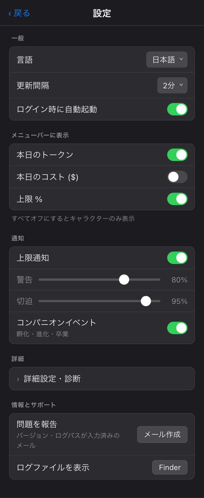
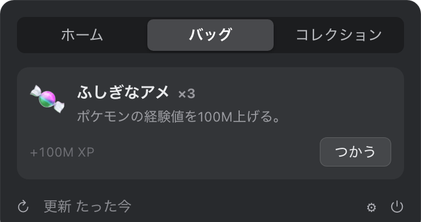
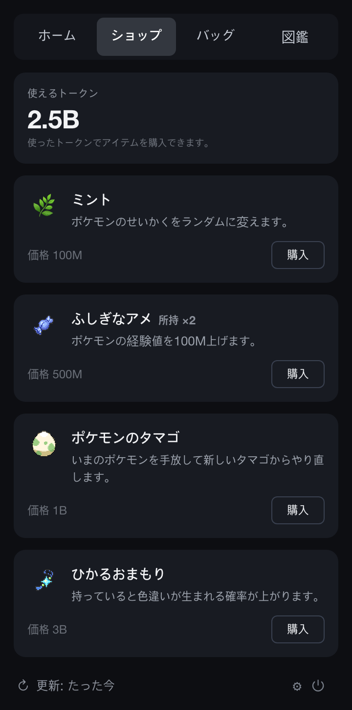

<div align="center">


# PokeTokenBar

**あなたのAIコーディングトークンを、ポケモンに — メニューバーで。**

[](https://github.com/chattymin/PokeTokenBar/releases)
[](https://www.apple.com/macos/)
[](https://swift.org)
[](#homebrew)
[](LICENSE)
[](https://github.com/sponsors/chattymin)

[English](README.md) · [한국어](README.ko.md) · **日本語**

</div>

PokeTokenBar は、あなたがすでに使っている AI コーディングトークン（Claude Code・Codex・Gemini CLI）を、macOS メニューバーの中で育っていく **ポケモンのパートナー** に変えます。トークンを使うとタマゴが孵化し、実際の進化ラインに沿って進化し、最終進化後に図鑑へ卒業して、また新しいタマゴが始まります。パートナーの下には正確な使用量トラッカーがあります — 今日の使用量・コスト、公式の5時間／週間上限を、ローカルログから直接読み取ります。

> トークン使用量はローカルの Claude Code・Codex・Gemini CLI ログから直接読み取ります（`totalTokens` = input + output + cache、ローカル日付）— 外部 CLI 不要。非公式・非商用のポケモンファンプロジェクトです — [ライセンス & 免責](#ライセンス--免責) を参照。

## なぜ

- **開くのが楽しい使用量トラッカー。** 使用量がポケモンを育てます — 孵化し、進化し、卒業して図鑑を埋めます。色違い1匹が、また開く理由になります。
- 今日のトークン使用量とコストを一目で — ダッシュボードもブラウザタブも不要。
- 公式の **5時間 / 週間** 上限をリセットのカウントダウンとともに追跡し、現在の burn rate でいつ到達するかを予測します。

<div align="center">

</div>

## しくみ

1. 🥚 **いつも通りコーディング。** Claude Code・Codex・Gemini CLI で使うトークンがタマゴを温めます — 追加の設定は不要。
2. 🐣 **孵化。** [PokéAPI](https://pokeapi.co/) の**第1〜5世代すべての進化系統（起点329種）**から、公式の捕獲率で重み付けされて生まれます — よくいるポケモンは頻繁に、伝説は129回に1回。孵化ごとに25種類のせいかくがひとつ決まり — **ごくまれな偶然で ✨ 色違いが生まれます**。
3. ⚡ **進化。** コーディングを続けると実際の進化ツリー（1/2/3段階、分岐）に沿って育ち、各段階で小さな演出が流れます。
4. 🎓 **卒業 & 収集。** 最終進化 + 閾値で **図鑑** に保存されます — レアなほど時間がかかり（ヘビーユーザーで common ≈3日 → legendary ≈24日）— 新しいタマゴが届きます。
5. 🍬 **上限を使い切ってごほうび。** 5時間または週間の使用量上限を使い切ると **ふしぎなアメ** がもらえます — 新しい **バッグ** タブから使って、いまのポケモンを育てましょう。
6. 🛒 **ショップで使う。** これまで使ったトークンがそのまま通貨です — 新しい **ショップ** タブで **ふしぎなアメ**、せいかくをランダムに引き直す **ミント**、色違い確率を永続的に上げる **光るお守り**、いまのパートナーを手放して新しいタマゴからやり直す **ポケモンのタマゴ** を購入できます。

## ツアー

<table>
<tr>
<td width="55%" valign="middle">
<h3>メニューバーの相棒</h3>
動く Gen-V スプライトが今日のトークン合計（compact、例：<code>200.7M</code>）の隣に住んでいます。今日のコスト（<code>$</code>）や公式上限 <code>%</code> を追加しても、すべてオフにしてキャラクターだけにしても。
</td>
<td width="45%" align="center"></td>
</tr>
<tr>
<td width="45%" align="center"></td>
<td width="55%" valign="middle">
<h3>✨ ごくまれな偶然、色違い</h3>
色違いはメニューバー・ホームカード・進化ライン・図鑑のどこでも専用カラーで表示され、進化しても維持されます。専用通知でその瞬間を見逃しません。
</td>
</tr>
<tr>
<td width="55%" valign="middle">
<h3>埋めたくなる図鑑</h3>
卒業したポケモンは進化ライン全体・レア度・せいかく・捕獲日とともに保存されます — 色違いには ✨ バッジ。いちばんレアな仲間が上に並ぶ順です。
</td>
<td width="45%" align="center"></td>
</tr>
<tr>
<td width="45%" align="center"></td>
<td width="55%" valign="middle">
<h3>設定はお好みで</h3>
メニューバー表示項目、更新間隔（1–15分／手動）、ログイン時に起動、上限セクションだけを隠す Keychain オフ、警告／危険の閾値つき上限通知、パートナーのイベント通知。<b>韓国語／英語／日本語</b>の UI とポケモン名を完備。
</td>
</tr>
<tr>
<td width="55%" valign="middle">
<h3>🍬 上限を使い切ると、ふしぎなアメ</h3>
5時間または週間の使用量上限を使い切ると <b>ふしぎなアメ</b> がもらえます — 5時間上限で1個、週間上限で5個。新しい <b>バッグ</b> タブから使っていまのポケモンを育てましょう。レート制限にかかった瞬間が、レベルアップの瞬間になります。
</td>
<td width="45%" align="center"></td>
</tr>
<tr>
<td width="45%" align="center"></td>
<td width="55%" valign="middle">
<h3>🛒 使用量で回るショップ</h3>
これまで使ったトークンがそのまま通貨です — 新しい <b>ショップ</b> タブで <b>ふしぎなアメ</b> で育てたり、<b>ミント</b> でせいかくを引き直したり、<b>光るお守り</b> で色違い確率を永続的に上げたり、<b>ポケモンのタマゴ</b> でいまのパートナーを手放して新しいタマゴからやり直したりできます。
</td>
</tr>
</table>

## そのほかにも

- **サービス別タブ** — 2つ以上接続すると小さなタブで詳細・上限をサービスごとに切替（今日の合計は合算のまま）。
- **公式の上限** — Claude・Codex の5時間／週間使用率とリセットのカウントダウンを、今日の数字のすぐ下に。
- **消費予測** — 現在の5時間ウィンドウが100%に達する時刻を予測。
- **アプリ内アップデート** — ワンクリックの更新確認、設定に現在のバージョンを表示。

## インストール

### 必要条件

macOS 14+（Apple Silicon または Intel）。それだけ — トークン使用量はローカルの Claude Code / Codex / Gemini CLI ログから直接読み取り、外部 CLI は不要です。

### Homebrew

```bash
brew install --cask chattymin/tap/poke-token-bar
```

ad-hoc／自己署名アプリのため、Cask インストール時に隔離属性を自動で除去します。

### 手動インストール（Homebrew なし）

Homebrew を使わない場合は、[最新リリース](https://github.com/chattymin/PokeTokenBar/releases/latest) から `PokeTokenBar.zip` をダウンロードして展開し、`PokeTokenBar.app` を `/Applications` にドラッグします。

このアプリは ad-hoc／自己署名（Apple Developer アカウントでの公証なし）のため、初回起動時に Gatekeeper が「開発元が未確認」の警告を表示します。次のいずれかで一度だけ解除してください。

- **Finder:** `PokeTokenBar.app` を右クリック（または Control+クリック）→ **開く** → ダイアログで再度 **開く**。
- **ターミナル:** `xattr -dr com.apple.quarantine /Applications/PokeTokenBar.app`

（Homebrew Cask は隔離属性を自動で除去するため、この手順は不要です。）

### ソースからビルド

```bash
swift build                  # デバッグ
swift test                   # ユニットテスト
./scripts/build-app.sh       # release → PokeTokenBar.app → /Applications
```

## データソース

| ソース | 用途 | 備考 |
|---|---|---|
| `~/.claude/projects/**/*.jsonl` | Claude Code daily/blocks/weekly/monthly | 直接読み取り；メッセージ id で重複排除；増分キャッシュ |
| `~/.gemini/tmp/**/chats/*.json(l)` | Gemini CLI daily/monthly | セッションレコード（メッセージ別 `tokens`）；週間 = daily 合算 |
| `~/.codex/sessions/**/*.jsonl` | Codex daily/monthly | `token_count` イベント；週間 = daily 合算 |
| Keychain → `oauth/usage` | Claude 公式 5h/週間 % | 非公式 endpoint；Keychain プロンプト1回後にキャッシュ |
| `codex app-server` | Codex 公式 5h/週間 % | アカウント snapshot のみ；モデル turn なし |
| [PokéAPI](https://pokeapi.co/) | ポケモンの種・進化・スプライト | ランタイム取得；ローカルキャッシュ、バンドルしない |

## プライバシー & 権限

- **オンデバイス。** トークン使用量はローカルの Claude Code / Codex / Gemini CLI ログから直接読み取り、アプリは `claude`/`codex` のモデル turn を実行せず、使用量のみ読み取ります。
- **Keychain（任意）。** 公式の上限を表示するため、Claude OAuth 資格情報を **1回**（パスワードのプロンプト1回）読み取り、アプリ自身の Keychain 項目にキャッシュして再利用します。設定でオフにすると上限セクションが非表示になります。
- **ポケモンのアセット** はランタイムに PokéAPI から取得し、`~/Library/Application Support/PokeTokenBar/` にのみキャッシュされます。著作物はこのリポジトリやリリースにバンドルしません。

## ライセンス & 免責

**MIT** — [LICENSE](LICENSE) を参照。MIT は本プロジェクトの**オリジナルソースコードのみ**を対象とし、アプリを通じてアクセスされる第三者の商標・アートワーク・データに関する権利を付与するものではありません。

PokeTokenBar は**非公式・非商用のファンプロジェクト**です。**任天堂、ゲームフリーク、クリーチャーズ、株式会社ポケモンとの提携・推奨・後援・承認はありません。**「ポケモン（Pokémon）」および関連する名称・キャラクター・画像は、各権利者の商標および著作物であり、本プロジェクトはポケモンの知的財産に対する所有権や権利を一切主張しません。

- **本リポジトリはいかなる著作物もバンドル・再配布しません。** ポケモンの種族データおよびスプライトは、公開されている [PokéAPI](https://pokeapi.co) から**実行時に**取得され、ユーザーの端末にローカルキャッシュされます。PokéAPI 経由で提供されるスプライト画像の権利は各権利者に帰属します。
- 本リポジトリのドキュメント（スクリーンショット/GIF）に表示されるポケモンの画像は、アプリの機能を説明する目的でのみ使用されています。
- 本アプリは**個人的・非商用の利用に限り**無償で提供されます。
- 権利者の方で本プロジェクトに懸念がある場合は、Issue を作成するかメンテナーまでご連絡ください。速やかに対応いたします。

*本プロジェクトは、いかなる保証もなく「現状のまま」提供されます。本免責事項は法的助言ではありません。*
