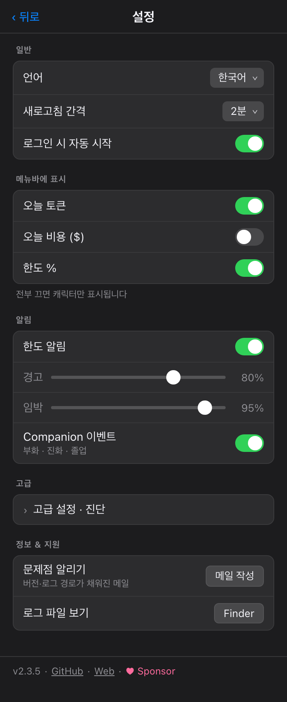
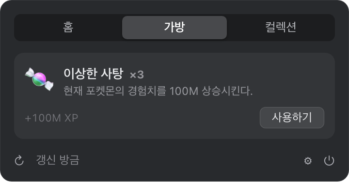

<div align="center">


# PokeTokenBar

**당신의 AI 코딩 토큰을 포켓몬으로 — 메뉴바에서.**

[](https://github.com/chattymin/PokeTokenBar/releases)
[](https://www.apple.com/macos/)
[](https://swift.org)
[](#homebrew)
[](LICENSE)
[](https://github.com/sponsors/chattymin)

[English](README.md) · **한국어** · [日本語](README.ja.md)

</div>

PokeTokenBar는 당신이 이미 태우고 있는 AI 코딩 토큰(Claude Code · Codex · Gemini CLI)을 macOS 메뉴바 속 자라나는 **포켓몬 companion**으로 바꿔줍니다. 토큰을 쓰면 알이 부화하고, 실제 진화 라인을 따라 진화하며, 최종 진화 후 도감에 졸업하고, 다시 새 알이 시작됩니다. companion 아래에는 정확한 사용량 트래커가 있습니다 — 오늘의 사용량·비용, 공식 5시간/주간 한도를 로컬 로그에서 직접 읽습니다.

> 토큰 사용량은 로컬 Claude Code·Codex·Gemini CLI 로그에서 직접 읽습니다(`totalTokens` = input + output + cache, 로컬 날짜) — 외부 CLI 불필요. 비공식·비상업 포켓몬 팬 프로젝트 — [라이선스 & 면책](#라이선스--면책) 참고.

## 왜

- **열어보는 게 즐거운 사용량 트래커.** 사용량이 포켓몬을 키웁니다 — 부화하고, 진화하고, 졸업해 도감을 채우죠. 이로치 한 마리가 다시 열어볼 이유가 됩니다.
- 오늘의 토큰 사용량과 비용을 한눈에 — 대시보드도, 브라우저 탭도 필요 없이.
- 공식 **5시간 / 주간** 한도를 리셋 카운트다운과 함께 추적하고, 현재 burn rate로 언제 도달할지 예측합니다.

<div align="center">

</div>

## 어떻게 자라나요

1. 🥚 **평소처럼 코딩하세요.** Claude Code·Codex·Gemini CLI 에서 태우는 토큰이 알을 품습니다 — 따로 돌릴 건 없어요.
2. 🐣 **부화.** [PokéAPI](https://pokeapi.co/)의 **1~5세대 모든 진화 계보(시작점 329종)**에서 공식 capture rate 가중으로 태어납니다 — 흔한 포켓몬은 자주, 전설은 부화 129번에 1번. 부화마다 25종 성격 중 하나가 정해지고 — **아주 특별한 우연으론 ✨ 이로치가 태어납니다**.
3. ⚡ **진화.** 계속 코딩하면 실제 진화 트리(1/2/3단, 분기)를 따라 자라고, 단계마다 작은 연출이 반겨줍니다.
4. 🎓 **졸업 & 수집.** 최종 진화 + 임계 도달 시 **도감**에 보존됩니다 — 희귀할수록 오래 걸리고(헤비 유저 기준 common ≈3일 → legendary ≈24일) — 새 알이 도착합니다.
5. 🍬 **한도 채우고 사탕 받기.** 5시간 또는 주간 사용량 한도를 다 채우면 **이상한 사탕**을 받아요 — 새 **가방** 탭에서 써서 현재 포켓몬을 키우세요.

## 둘러보기

<table>
<tr>
<td width="55%" valign="middle">
<h3>메뉴바 속 파트너</h3>
움직이는 Gen-V 스프라이트가 오늘 토큰 합계(compact, 예: <code>200.7M</code>) 옆에 삽니다. 오늘 비용(<code>$</code>)이나 공식 한도 <code>%</code> 를 더하거나 — 전부 꺼서 캐릭터만 남길 수도 있어요.
</td>
<td width="45%" align="center"></td>
</tr>
<tr>
<td width="45%" align="center"></td>
<td width="55%" valign="middle">
<h3>✨ 아주 드문 우연, 이로치</h3>
이로치는 메뉴바·홈 카드·진화 라인·도감 어디서나 전용 색으로 표시되고, 진화를 거쳐도 유지됩니다. 전용 알림이 그 순간을 놓치지 않게 해줘요.
</td>
</tr>
<tr>
<td width="55%" valign="middle">
<h3>채우고 싶어지는 도감</h3>
졸업한 포켓몬은 전체 진화 라인·희귀도·성격·획득일과 함께 보존됩니다 — 이로치는 ✨ 배지를 답니다. 가장 희귀한 수집이 맨 위에 오도록 정렬돼요.
</td>
<td width="45%" align="center"></td>
</tr>
<tr>
<td width="45%" align="center"></td>
<td width="55%" valign="middle">
<h3>설정에서 취향대로</h3>
메뉴바 표시 항목, 새로고침 간격(1–15분/수동), 로그인 시 자동 시작, 한도 섹션만 숨기는 Keychain 끄기, 경고/임박 임계값 한도 알림, companion 이벤트 알림. <b>한국어/영어/일본어</b> UI·포켓몬 이름 완비.
</td>
</tr>
<tr>
<td width="55%" valign="middle">
<h3>🍬 한도를 채우면 이상한 사탕</h3>
5시간 또는 주간 사용량 한도를 다 채우면 <b>이상한 사탕</b>을 받습니다 — 5시간 한도당 1개, 주간 한도당 5개. 새 <b>가방</b> 탭에서 현재 포켓몬에게 써서 키우세요: 막히는 순간이 곧 성장하는 순간이 됩니다.
</td>
<td width="45%" align="center"></td>
</tr>
</table>

## 이 밖에도

- **서비스별 탭** — 2개 이상 연결되면 작은 탭으로 상세·한도를 서비스별로 전환(오늘 합계는 통합 유지).
- **공식 한도** — Claude·Codex 5시간/주간 사용률 + 리셋 카운트다운을 오늘 숫자 바로 아래에.
- **소진 예측** — 현재 5시간 창이 100%에 도달할 시각 예측.
- **인앱 업데이트** — 원클릭 업데이트 확인, 설정에 현재 버전 표시.

## 설치

### 요구사항

macOS 14+ (Apple Silicon 또는 Intel). 끝입니다 — 토큰 사용량은 로컬 Claude Code/Codex/Gemini CLI 로그에서 직접 읽으며 외부 CLI가 필요 없습니다.

### Homebrew

```bash
brew install --cask chattymin/tap/poke-token-bar
```

ad-hoc/자체 서명 앱이라 Cask 설치 시 격리 속성을 자동 제거합니다.

### 소스 빌드

```bash
swift build                  # 디버그
swift test                   # 단위 테스트
./scripts/build-app.sh       # release → PokeTokenBar.app → /Applications
```

## 데이터 소스

| 소스 | 용도 | 비고 |
|---|---|---|
| `~/.claude/projects/**/*.jsonl` | Claude Code daily/blocks/weekly/monthly | 직접 읽음; 메시지 id 로 중복제거; 증분 캐시 |
| `~/.gemini/tmp/**/chats/*.json(l)` | Gemini CLI daily/monthly | 세션 레코드(메시지별 `tokens`); 주간 = daily 합산 |
| `~/.codex/sessions/**/*.jsonl` | Codex daily/monthly | `token_count` 이벤트; 주간 = daily 합산 |
| Keychain → `oauth/usage` | Claude 공식 5h/주간 % | 비공식 endpoint; Keychain 프롬프트 1회 후 캐시 |
| `codex app-server` | Codex 공식 5h/주간 % | 계정 snapshot만; 모델 turn 없음 |
| [PokéAPI](https://pokeapi.co/) | 포켓몬 종·진화·스프라이트 | 런타임 fetch; 로컬 캐시, 번들 안 함 |

## 프라이버시 & 권한

- **온디바이스.** 토큰 사용량은 로컬 Claude Code/Codex/Gemini CLI 로그에서 직접 읽으며, 앱은 `claude`/`codex` 모델 turn을 실행하지 않고 사용량만 읽습니다.
- **Keychain(선택).** 공식 한도를 보여주려면 Claude OAuth 자격증명을 **1회**(비밀번호 프롬프트 1번) 읽고, 앱 자체 Keychain 항목에 캐시해 재사용합니다. 설정에서 끄면 한도 섹션만 숨겨집니다.
- **포켓몬 에셋**은 런타임에 PokéAPI에서 받아오며 `~/Library/Application Support/PokeTokenBar/`에만 캐시됩니다. 저작물은 레포나 릴리스에 번들하지 않습니다.

## 라이선스 & 면책

**MIT** — [LICENSE](LICENSE) 참고. MIT는 본 프로젝트의 소스 코드에만 적용됩니다.

비공식·비상업 팬 프로젝트입니다. **Nintendo, Game Freak, The Pokémon Company와 제휴·보증·후원·승인 관계가 없습니다.** Pokémon 및 포켓몬 캐릭터 이름은 Nintendo의 상표이며, 포켓몬 이름·데이터·스프라이트는 © Nintendo / Game Freak / The Pokémon Company로 식별 목적의 런타임 사용입니다.
