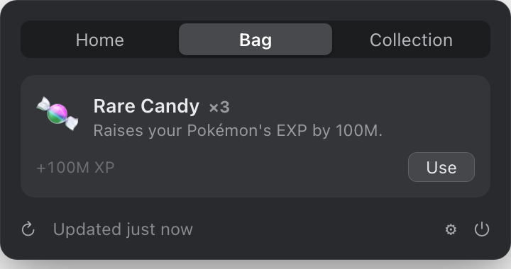
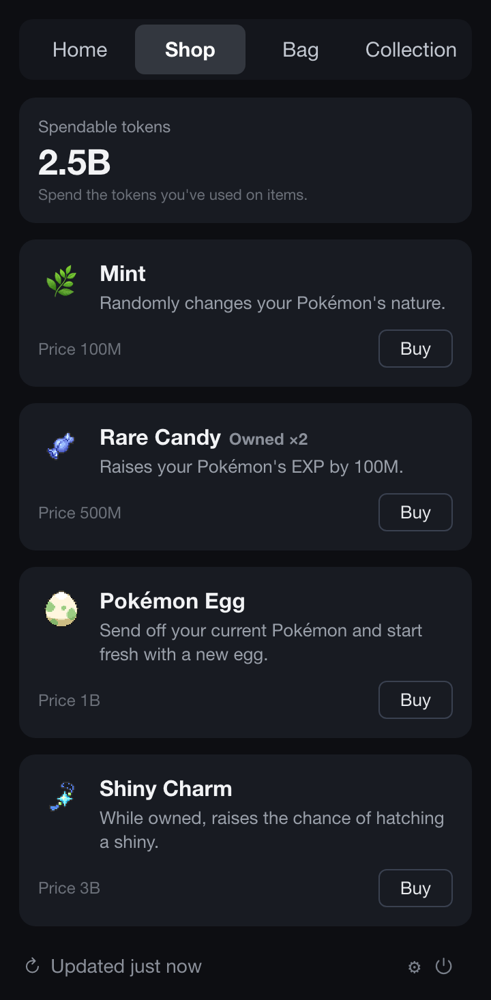

<div align="center">


# PokeTokenBar

**Your AI coding tokens, hatched into Pokémon — right in your menu bar.**

[](https://github.com/chattymin/PokeTokenBar/releases)
[](https://www.apple.com/macos/)
[](https://swift.org)
[](#homebrew)
[](LICENSE)
[](https://github.com/sponsors/chattymin)

**English** · [한국어](README.ko.md) · [日本語](README.ja.md)

</div>

PokeTokenBar turns the AI coding tokens you're already burning — Claude Code, Codex & Gemini CLI — into a growing **Pokémon companion** in your macOS menu bar. Spend tokens, hatch an egg, evolve it through its real evolution line, graduate it into your Pokédex, and start again. Underneath the companion it's a precise usage tracker — today's spend, cost, and official 5-hour / weekly limits, read straight from your local logs.

> Token usage is read directly from your local Claude Code, Codex & Gemini CLI logs (`totalTokens` = input + output + cache, local date) — no external CLI needed. Unofficial, non-commercial Pokémon fan project — see [License & disclaimer](#license--disclaimer).

## Why

- **The usage tracker you actually enjoy opening.** Your spend raises a Pokémon that hatches, evolves, graduates, and fills a Pokédex — and every shiny is a reason to check back.
- See today's token spend & cost at a glance — no dashboard, no browser tab.
- Track official **5-hour / weekly** limits with reset countdowns and a burn-rate forecast for when you'll hit them.

<div align="center">

</div>

## How it works

1. 🥚 **Code as usual.** The tokens you burn in Claude Code, Codex & Gemini CLI incubate an egg — nothing extra to run.
2. 🐣 **Hatch.** Eggs hatch into Pokémon with real evolution lines from [PokéAPI](https://pokeapi.co/) — any Gen 1–5 line (329 possible starts), weighted by the official capture rate: commons hatch often, a legendary is a 1-in-129 event. Every hatch rolls one of 25 natures — and once in a rare while, the egg hatches **✨ Shiny**.
3. ⚡ **Evolve.** Keep coding and it grows through its actual evolution tree (1/2/3 stages, branching), with a little flash celebration at each step.
4. 🎓 **Graduate & collect.** Final form + threshold sends it to your **Pokédex** — rarer takes longer (≈3 days common → ≈24 days legendary at heavy use) — and a fresh egg arrives.
5. 🍬 **Max out, get a candy.** Fill a 5-hour or weekly usage limit and you earn **Rare Candy** — spend it from the **Bag** to grow your current Pokémon.
6. 🛒 **Spend at the Shop.** Every token you've used is spendable currency — buy **Rare Candy**, a **Mint** that re-rolls your Pokémon's nature, or a **Shiny Charm** that permanently raises your shiny odds, from the new **Shop** tab.

## Tour

<table>
<tr>
<td width="55%" valign="middle">
<h3>In your menu bar</h3>
An animated Gen-V sprite lives next to today's total tokens (compact, e.g. <code>200.7M</code>). Add today's cost (<code>$</code>) or official limit <code>%</code> — or turn everything off for a character-only bar.
</td>
<td width="45%" align="center"></td>
</tr>
<tr>
<td width="45%" align="center"></td>
<td width="55%" valign="middle">
<h3>✨ Once in a rare while — Shiny</h3>
Shiny hatches keep their distinct colors everywhere — menu bar, home card, evolution line, Pokédex — through every evolution. A dedicated notification makes sure you don't miss the moment.
</td>
</tr>
<tr>
<td width="55%" valign="middle">
<h3>A Pokédex worth filling</h3>
Graduated Pokémon are preserved with their full evolution line, rarity, nature, and capture date — shinies wear a ✨ badge. Sorted so your rarest catches sit on top.
</td>
<td width="45%" align="center"></td>
</tr>
<tr>
<td width="45%" align="center"></td>
<td width="55%" valign="middle">
<h3>Tune it your way</h3>
Menu-bar items, refresh interval (1–15 min or manual), launch at login, a Keychain opt-out that just hides the limits section, limit alerts with warning/critical thresholds, and companion event notifications. Full <b>KO / EN / JA</b> UI and Pokémon names.
</td>
</tr>
<tr>
<td width="55%" valign="middle">
<h3>🍬 Fill a limit, earn a Rare Candy</h3>
Max out a 5-hour or weekly usage limit and you're handed a <b>Rare Candy</b> — one per 5-hour cap, five per weekly. Spend it from the new <b>Bag</b> tab to grow your current Pokémon: the moment you're rate-limited becomes the moment you level up.
</td>
<td width="45%" align="center"></td>
</tr>
<tr>
<td width="45%" align="center"></td>
<td width="55%" valign="middle">
<h3>🛒 A shop that runs on your usage</h3>
The tokens you've already used are your currency. Spend them in the new <b>Shop</b> tab on <b>Rare Candy</b> to grow your current Pokémon, a <b>Mint</b> to re-roll its nature, or a <b>Shiny Charm</b> that permanently raises your shiny hatch odds.
</td>
</tr>
</table>

## Also in the box

- **Per-service tabs** — with more than one CLI connected, compact tabs switch the detail & limits between Claude Code / Codex / Gemini; today's total stays combined.
- **Official limits** — Claude & Codex 5-hour / weekly utilization with reset countdowns, right under today's numbers.
- **Burn-rate forecast** — projects when the current 5h window hits 100%.
- **In-app updates** — one-click update check; current version shown in Settings.

## Install

### Requirements

macOS 14+ (Apple Silicon or Intel). That's it — token usage is read directly from your local Claude Code / Codex / Gemini CLI logs, no external CLI required.

### Homebrew

```bash
brew install --cask chattymin/tap/poke-token-bar
```

ad-hoc/self-signed; the cask strips the quarantine attribute on install.

### Manual install (without Homebrew)

Prefer not to use Homebrew? Download `PokeTokenBar.zip` from the [latest release](https://github.com/chattymin/PokeTokenBar/releases/latest), unzip it, and drag `PokeTokenBar.app` into `/Applications`.

Because the app is ad-hoc/self-signed (not notarized under an Apple Developer account), Gatekeeper shows an "unidentified developer" warning on first launch. Clear it once, either way:

- **Finder:** right-click (or Control-click) `PokeTokenBar.app` → **Open** → **Open** again in the dialog.
- **Terminal:** `xattr -dr com.apple.quarantine /Applications/PokeTokenBar.app`

(The Homebrew cask strips quarantine for you, so it needs no extra step.)

### Build from source

```bash
swift build                  # debug
swift test                   # unit tests
./scripts/build-app.sh       # release → PokeTokenBar.app → /Applications
```

## Data sources

| Source | Used for | Notes |
|---|---|---|
| `~/.claude/projects/**/*.jsonl` | Claude Code daily/blocks/weekly/monthly | read directly; deduped by message id; cached incrementally |
| `~/.gemini/tmp/**/chats/*.json(l)` | Gemini CLI daily/monthly | session records (`tokens` per message); weekly = daily sum |
| `~/.codex/sessions/**/*.jsonl` | Codex daily/monthly | `token_count` events; weekly = daily sum |
| Keychain → `oauth/usage` | Claude official 5h/weekly % | unofficial endpoint; single Keychain prompt, then cached |
| `codex app-server` | Codex official 5h/weekly % | account snapshot only; no model turn |
| [PokéAPI](https://pokeapi.co/) | Pokémon species, evolution, sprites | runtime fetch; cached locally, never bundled |

## Privacy & permissions

- **On-device.** Token usage is read directly from your local Claude Code / Codex / Gemini CLI logs; the app never runs `claude`/`codex` model turns, only reads usage.
- **Keychain (optional).** To show official limits it reads the Claude OAuth credential **once** (a single password prompt), then caches it in the app's own Keychain item for reuse. Turn it off in Settings — the limits section simply hides.
- **Pokémon assets** are fetched at runtime from PokéAPI and cached only under `~/Library/Application Support/PokeTokenBar/`. Nothing copyrighted is bundled in this repository or its releases.

## License & disclaimer

**MIT** — see [LICENSE](LICENSE). The MIT license covers this project's original source code only; it grants no rights to any third-party trademarks, artwork, or data accessed through the app.

PokeTokenBar is an **unofficial, non-commercial fan project**. It is **not affiliated with, endorsed, sponsored, or approved by Nintendo, Game Freak, Creatures Inc., or The Pokémon Company.** "Pokémon" and all related names, characters, and imagery are trademarks and copyrights of their respective owners. This project claims no ownership of, and asserts no rights over, any Pokémon intellectual property.

- **No copyrighted assets are bundled or redistributed by this repository.** Pokémon species data and sprites are fetched **at runtime** from the public [PokéAPI](https://pokeapi.co) and cached locally on the user's own device; sprite images served via PokéAPI remain the property of their respective owners.
- Any Pokémon imagery in this repository's documentation (screenshots/GIFs) is shown solely to illustrate the app's functionality.
- The app is provided free of charge for **personal, non-commercial use only.**
- If you are a rights holder with any concern about this project, please open an issue or contact the maintainer, and we will respond promptly.

*Provided "as is", without warranty of any kind. This notice is not legal advice.*
