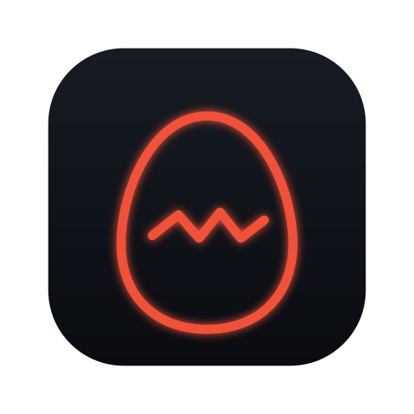
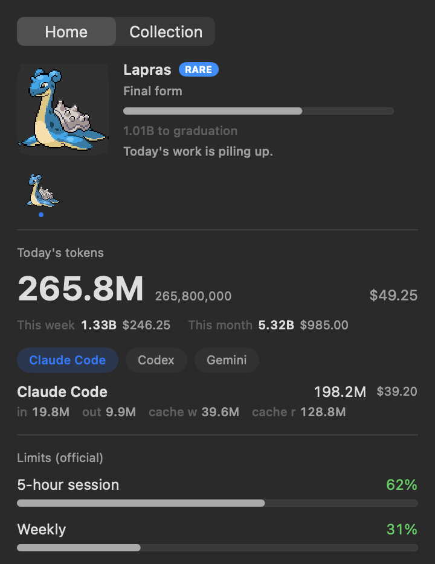
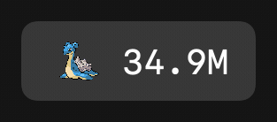
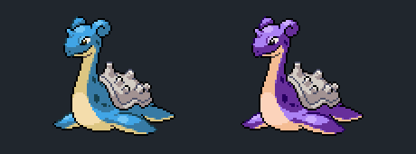
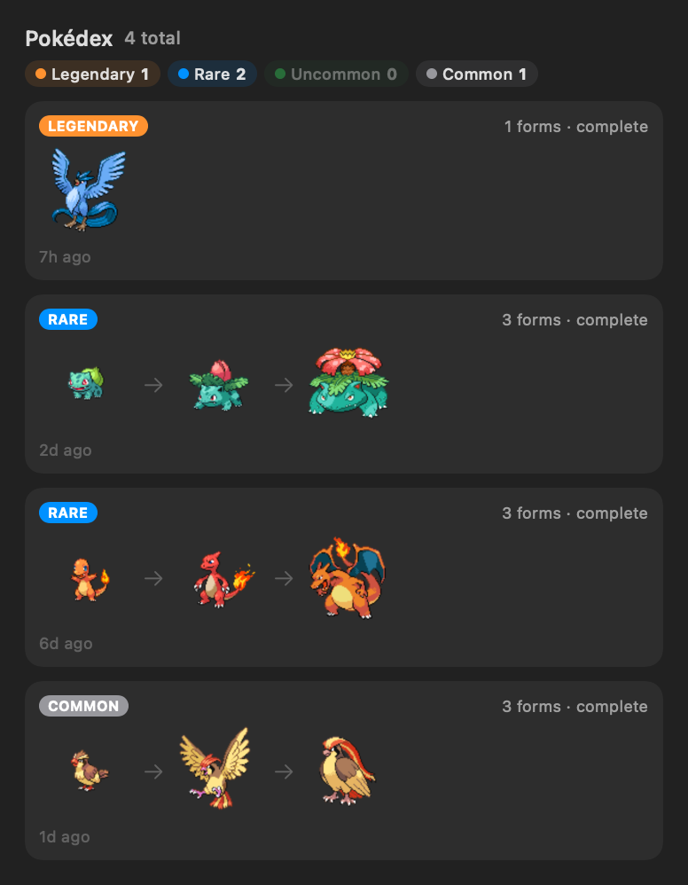
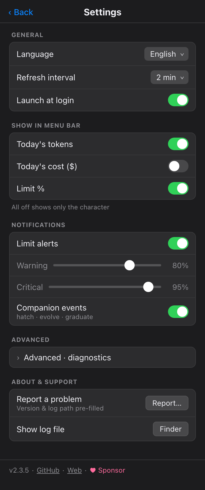

<div align="center">



# PokeTokenBar

**Your AI coding tokens, hatched into Pokémon — right in your menu bar.**

[](https://github.com/chattymin/PokeTokenBar/releases)
[](https://www.apple.com/macos/)
[](https://swift.org)
[](#homebrew)
[](LICENSE)

**English** · [한국어](README.ko.md) · [日本語](README.ja.md)

</div>

PokeTokenBar shows how many AI coding tokens you've burned today — Claude Code & Codex — in your macOS menu bar, and turns that usage into a growing **Pokémon companion**. Spend tokens, hatch an egg, evolve it through its real evolution line, graduate it into your Pokédex, and start again.

> Token usage is read directly from your local Claude Code & Codex logs (`totalTokens` = input + output + cache, local date) — no external CLI needed. Unofficial, non-commercial Pokémon fan project — see [License & disclaimer](#license--disclaimer).

## Why

- See today's token spend & cost at a glance — no dashboard, no browser tab.
- Track official **5-hour / weekly** limits with reset countdowns and a burn-rate forecast for when you'll hit them.
- …and actually enjoy opening it: your usage raises a Pokémon that evolves, graduates, and fills a Pokédex.

<div align="center">

</div>

## How it works

1. 🥚 **Code as usual.** The tokens you burn in Claude Code & Codex incubate an egg — nothing extra to run.
2. 🐣 **Hatch.** Eggs hatch into Pokémon with real evolution lines from [PokéAPI](https://pokeapi.co/), rarity-weighted from common to legendary. Every hatch rolls one of 25 natures — and **1 in 64 is ✨ shiny**.
3. ⚡ **Evolve.** Keep coding and it grows through its actual evolution tree (1/2/3 stages, branching), with a little flash celebration at each step.
4. 🎓 **Graduate & collect.** Final form + threshold sends it to your **Pokédex** — rarer takes longer (≈3 days common → ≈24 days legendary at heavy use) — and a fresh egg arrives.

## Tour

<table>
<tr>
<td width="55%" valign="middle">
<h3>In your menu bar</h3>
An animated Gen-V sprite lives next to today's total tokens (compact, e.g. <code>200.7M</code>). Add today's cost (<code>$</code>) or official limit <code>%</code> — or turn everything off for a character-only bar.
</td>
<td width="45%" align="center"></td>
</tr>
<tr>
<td width="45%" align="center"></td>
<td width="55%" valign="middle">
<h3>✨ One in 64 is shiny</h3>
Shiny hatches keep their distinct colors everywhere — menu bar, home card, evolution line, Pokédex — through every evolution. A dedicated notification makes sure you don't miss the moment.
</td>
</tr>
<tr>
<td width="55%" valign="middle">
<h3>A Pokédex worth filling</h3>
Graduated Pokémon are preserved with their full evolution line, rarity, nature, and capture date — shinies wear a ✨ badge. Sorted so your rarest catches sit on top.
</td>
<td width="45%" align="center"></td>
</tr>
<tr>
<td width="45%" align="center"></td>
<td width="55%" valign="middle">
<h3>Tune it your way</h3>
Menu-bar items, refresh interval (1–15 min or manual), launch at login, a Keychain opt-out that just hides the limits section, limit alerts with warning/critical thresholds, and companion event notifications. Full <b>KO / EN / JA</b> UI and Pokémon names.
</td>
</tr>
</table>

## Also in the box

- **Official limits** — Claude & Codex 5-hour / weekly utilization with reset countdowns, right under today's numbers.
- **Burn-rate forecast** — projects when the current 5h window hits 100%.
- **In-app updates** — one-click update check; current version shown in Settings.

## Install

### Requirements

macOS 14+ (Apple Silicon or Intel). That's it — token usage is read directly from your local Claude Code / Codex logs, no external CLI required.

### Homebrew

```bash
brew install --cask chattymin/tap/poke-token-bar
```

ad-hoc/self-signed; the cask strips the quarantine attribute on install.

### Build from source

```bash
swift build                  # debug
swift test                   # unit tests
./scripts/build-app.sh       # release → PokeTokenBar.app → /Applications
```

## Data sources

| Source | Used for | Notes |
|---|---|---|
| `~/.claude/projects/**/*.jsonl` | Claude Code daily/blocks/weekly/monthly | read directly; deduped by message id; cached incrementally |
| `~/.codex/sessions/**/*.jsonl` | Codex daily/monthly | `token_count` events; weekly = daily sum |
| Keychain → `oauth/usage` | Claude official 5h/weekly % | unofficial endpoint; single Keychain prompt, then cached |
| `codex app-server` | Codex official 5h/weekly % | account snapshot only; no model turn |
| [PokéAPI](https://pokeapi.co/) | Pokémon species, evolution, sprites | runtime fetch; cached locally, never bundled |

## Privacy & permissions

- **On-device.** Token usage is read directly from your local Claude Code / Codex logs; the app never runs `claude`/`codex` model turns, only reads usage.
- **Keychain (optional).** To show official limits it reads the Claude OAuth credential **once** (a single password prompt), then caches it in the app's own Keychain item for reuse. Turn it off in Settings — the limits section simply hides.
- **Pokémon assets** are fetched at runtime from PokéAPI and cached only under `~/Library/Application Support/PokeTokenBar/`. Nothing copyrighted is bundled in this repository or its releases.

## License & disclaimer

**MIT** — see [LICENSE](LICENSE). The MIT license covers this project's source code only.

This is an unofficial, non-commercial fan project. It is **not affiliated with, endorsed, sponsored, or approved by Nintendo, Game Freak, or The Pokémon Company.** Pokémon and Pokémon character names are trademarks of Nintendo; Pokémon names, data, and sprites are © Nintendo / Game Freak / The Pokémon Company and are fetched at runtime for identification only.
