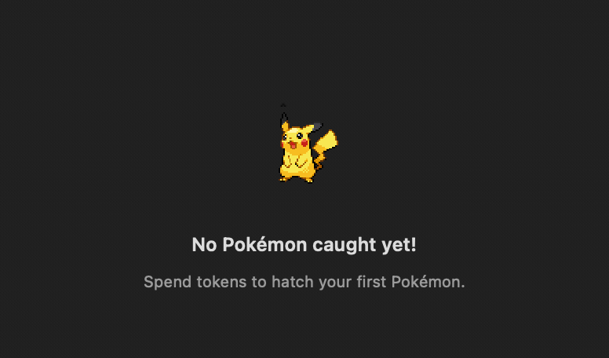

<div align="center">


# PokeTokenBar

**Your AI coding tokens, hatched into Pokémon — right in your menu bar.**

[](https://github.com/chattymin/PokeTokenBar/releases)
[](https://www.apple.com/macos/)
[](https://swift.org)
[](#homebrew)
[](LICENSE)

**English** · [한국어](README.ko.md) · [日本語](README.ja.md)

</div>

PokeTokenBar shows how many AI coding tokens you've burned today — Claude Code & Codex — in your macOS menu bar, and turns that usage into a growing **Pokémon companion**. Spend tokens, hatch an egg, evolve it through its real evolution line, graduate it into your Pokédex, and start again.

> Token usage is read directly from your local Claude Code & Codex logs (`totalTokens` = input + output + cache, local date) — no external CLI needed. Unofficial, non-commercial Pokémon fan project — see [License & disclaimer](#license--disclaimer).

## Why

- See today's token spend & cost at a glance — no dashboard, no browser tab.
- Track official **5-hour / weekly** limits with reset countdowns and a burn-rate forecast for when you'll hit them.
- …and actually enjoy opening it: your usage raises a Pokémon that evolves, graduates, and fills a Pokédex.

## Screenshots

<table>
<tr>
<td width="50%" valign="top">
<br>
<b>Home</b> — companion + evolution progress, today's tokens (Claude Code + Codex with cost), and official 5h/weekly limit bars.
</td>
<td width="50%" valign="top">
<br>
<b>Collection (Pokédex)</b> — graduated Pokémon, sorted by rarity, with full evolution lines and capture dates.
</td>
</tr>
<tr>
<td width="50%" valign="top">
<br>
<b>Empty Pokédex</b> — an animated mascot nudges you to start.
</td>
<td width="50%" valign="top">
<br>
<b>Menu bar</b> — animated companion + today's tokens; add cost ($) or limit % in Settings.
</td>
</tr>
<tr>
<td width="50%" valign="top">
<br>
<b>Settings</b> — menu-bar items (tokens / cost / limit %), refresh interval, launch at login, Keychain opt-out, and notification thresholds.
</td>
<td width="50%" valign="top"></td>
</tr>
</table>

## The companion

- **Hatch & evolve** — eggs hatch into Pokémon fetched live from [PokéAPI](https://pokeapi.co/); tokens spent since install evolve them through their real tree (1/2/3 stages, branching).
- **Rarity-weighted** — common hatch often, legendary rarely; rarer Pokémon take more tokens to graduate (≈3 days common → ≈24 days legendary at heavy use).
- **Graduate & collect** — reach the final evolution + threshold and it graduates to your **Pokédex**; a fresh egg arrives.
- **Animated** — Gen-V sprites animate in the menu bar and popover. Names & UI in **Korean / English / Japanese**.

## Features

- **Live token usage** — today's Claude Code + Codex tokens, refreshed every 1–15 min (or manually).
- **Menu bar, your way** — show any mix of today's tokens (compact, e.g. `200.7M`), today's cost (`$`), and official limit `%` next to the companion — or none, for a character-only menu bar.
- **Official limits** — Claude & Codex 5-hour / weekly utilization with reset countdowns.
- **Burn-rate forecast** — projects when the current 5h window hits 100%.
- **Growth companion + Pokédex** — the part you actually look forward to.
- **Localized** — full KO / EN / JA UI and Pokémon names.
- **Notifications** — limit alerts with adjustable warning / critical thresholds, plus optional companion events (hatch / evolve / graduate).
- **Quality of life** — launch at login, in-app update check (current version shown in Settings), and a Keychain opt-out that just hides the limits section.

## Install

### Requirements

macOS 14+ (Apple Silicon or Intel). That's it — token usage is read directly from your local Claude Code / Codex logs, no external CLI required.

### Homebrew

```bash
brew install --cask chattymin/tap/poke-token-bar
```

ad-hoc/self-signed; the cask strips the quarantine attribute on install.

### Build from source

```bash
swift build                  # debug
swift test                   # unit tests
./scripts/build-app.sh       # release → PokeTokenBar.app → /Applications
```

## Data sources

| Source | Used for | Notes |
|---|---|---|
| `~/.claude/projects/**/*.jsonl` | Claude Code daily/blocks/weekly/monthly | read directly; deduped by message id; cached incrementally |
| `~/.codex/sessions/**/*.jsonl` | Codex daily/monthly | `token_count` events; weekly = daily sum |
| Keychain → `oauth/usage` | Claude official 5h/weekly % | unofficial endpoint; single Keychain prompt, then cached |
| `codex app-server` | Codex official 5h/weekly % | account snapshot only; no model turn |
| [PokéAPI](https://pokeapi.co/) | Pokémon species, evolution, sprites | runtime fetch; cached locally, never bundled |

## Privacy & permissions

- **On-device.** Token usage is read directly from your local Claude Code / Codex logs; the app never runs `claude`/`codex` model turns, only reads usage.
- **Keychain (optional).** To show official limits it reads the Claude OAuth credential **once** (a single password prompt), then caches it in the app's own Keychain item for reuse. Turn it off in Settings — the limits section simply hides.
- **Pokémon assets** are fetched at runtime from PokéAPI and cached only under `~/Library/Application Support/PokeTokenBar/`. Nothing copyrighted is bundled in this repository or its releases.

## License & disclaimer

**MIT** — see [LICENSE](LICENSE). The MIT license covers this project's source code only.

This is an unofficial, non-commercial fan project. It is **not affiliated with, endorsed, sponsored, or approved by Nintendo, Game Freak, or The Pokémon Company.** Pokémon and Pokémon character names are trademarks of Nintendo; Pokémon names, data, and sprites are © Nintendo / Game Freak / The Pokémon Company and are fetched at runtime for identification only.
